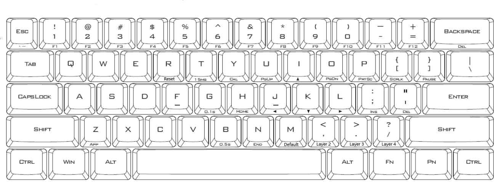

# POK3R RGB Keyboard

[POK3R User Manual](http://www.vortexgear.tw/db/upload/webdata4/6vortex_2017111621402892449.pdf) (2017)

[POK3R User Manual](http://www.vortexgear.tw/db/upload/webdata4/6vortex_20166523361966663.pdf) (2016)

## DIP Switches

| Switch | State | Notes|
|---|---|---|
| 1 | :white_circle: | For choosing layouts |
| 2 | :white_circle: | For choosing layouts |
| 3 | :white_circle: | For switching <kbd>Capslock</kbd> as <kbd>FN</kbd> |
| 4 | :white_circle: | For choosing any key for <kbd>FN</kbd> and <kbd>PN</kbd>|

Choose <kbd>Capslock</kbd> as <kbd>FN</kbd>

| Switch 3 | <kbd>FN</kbd> |
|---|---|
| :white_circle: | <kbd>Right Windows</kbd> |
| :radio_button: | <kbd>Capslock</kbd> |

Choose layout

| Switch 1 | Switch 2 | Layout |
|---|---|---|
|:white_circle:|:white_circle:|Qwerty|
|:white_circle:|:radio_button:|Qwerty|
|:radio_button:|:white_circle:|Dvorak|
|:radio_button:|:radio_button:|Colemak|

## Special Progarmming Keys

<kbd>Ctrl</kbd> <kbd>Win </kbd> <kbd>Alt </kbd> <kbd>       Space   ...      bar     </kbd> <kbd>Alt </kbd> <kbd>Win [FN]</kbd> <kbd>Menu [PN]</kbd> <kbd>Ctrl</kbd>

**<kbd>FN</kbd>** Function

**<kbd>PN</kbd>** Programming

Default Dip Switch 3 off

|  |  |
|---|---|
|FN| <kbd>Right Windows</kbd> |
|PN| <kbd>Menu</kbd> |

With Dip Switch 3 On

|  |  |
|---|---|
|<kbd>FN</kbd>| <kbd>Caps lock</kbd> |
|<kbd>PN</kbd>| <kbd>Menu</kbd> |

## Layers

| Layer | Switch | Spacebar Left LED|
|---|---|---|
| 1 | <kbd>FN</kbd> + <kbd>M</kbd> | OFF |
| 2 | <kbd>FN</kbd> + <kbd><,</kbd> | BLUE |
| 3 | <kbd>FN</kbd> + <kbd>>.</kbd> | RED |
| 4 | <kbd>FN</kbd> + <kbd>>/</kbd> | PURPLE |

## Arrow cluster

Enable/disable arrow key cluster

<kbd>Left Win</kbd> + <kbd>Spacebar</kbd> + <kbd>Right Alt</kbd>

| | |
|---|---|
| :arrow_up: | <kbd>Right Shift</kbd> |
| :arrow_down: | <kbd>Menu</kbd> |
| :arrow_left: | <kbd>Right Windows</kbd> |
| :arrow_right: | <kbd>Right Control</kbd> |

## Programming

### To make <kbd>FN</kbd> + <kbd>3</kbd> to print hackorama with enter at the end

Turn off arrow keys cluster if enabled so that we can use the <kbd>PN</kbd> key which is part of the arrow cluster.

| Press | Does | Right LED |
|---|---|---|
|<kbd>FN</kbd> + <kbd><,</kbd> |Switch to second layer | OFF |
|<kbd>FN</kbd> + <kbd>^ Right Control</kbd>| Emter Programming Mode| ON |
| <kbd>FN</kbd> + <kbd>3</kbd> | The key you want to program | FLASH |
| hackorama<kbd>Enter</kbd> | Enter all the macro content keys | FLASH |
| <kbd>PN</kbd> | Store the macro content | ON |
| <kbd>FN</kbd> + <kbd>Right Control</kbd> | Exit Programming mode | OFF |

### On Mac switch <kbd>Windows</kbd> and <kbd>Left Alt</kbd> to be <kbd>⌘ Left Command</kbd> and <kbd>⌥ Left Option</kbd>

Turn off arrow keys cluster if enabled so that we can use the <kbd>PN</kbd> key which is part of the arrow cluster.

| Press | Does | Right LED |
|---|---|---|
| <kbd>FN</kbd> + <kbd><,</kbd> |Switch to second layer | OFF |
| <kbd>FN</kbd> + <kbd>Right Control</kbd>| Enter Programming Mode| ON |
| <kbd>Left Alt</kbd> | The key you want to program | FLASH |
| <kbd>Left Windows</kbd> | Enter all the macro content keys | FLASH |
| <kbd>PN</kbd> | Store the macro content | ON |
| <kbd>Left Windows</kbd> | The key you want to program | FLASH |
| <kbd>Left Alt</kbd> | Enter all the macro content keys | FLASH |
| <kbd>PN</kbd> | Store the macro content | ON |
| <kbd>FN</kbd> + <kbd>^ Right Control</kbd> | Exit Programming mode | OFF |

## Restore settings

### Reset specific layer

Select the layer to reset

| Press | For | Left LED |
|---|---|---|
| <kbd>FN</kbd> + <kbd>R</kbd> | 5 seconds | Will Flash |

### All layers

| Press | For | Left LED |
|---|---|---|
| <kbd>Left Alt</kbd> + <kbd>Right Alt</kbd> | 5 seconds | Will Flash |

### Reset <kbd>FN</kbd>

Press <kbd>Right Alt</kbd> + <kbd>R</kbd>

### Factory reset (programming, lighting and other settings)

| Press | For | Left LED |
|---|---|---|
| <kbd>FN</kbd> + <kbd>Spacebar</kbd> | 5 seconds | Will Flash |

## Function Keys

| | |
|---|---|
| <kbd>FN</kbd> + <kbd>1</kbd> ...<kbd>9</kbd>   | <kbd>F1</kbd> ... <kbd>F9</kbd>|
| <kbd>FN</kbd> + <kbd>0</kbd> | <kbd>F10</kbd> |
| <kbd>FN</kbd> + <kbd>-_</kbd> | <kbd>F11</kbd> |
| <kbd>FN</kbd> + <kbd>=+</kbd> | <kbd>F12</kbd> |

| | |
|---|---|
| <kbd>FN</kbd> + <kbd>I</kbd> | :arrow_up: |
| <kbd>FN</kbd> + <kbd>J</kbd> | :arrow_left: |
| <kbd>FN</kbd> + <kbd>K</kbd> | :arrow_down: |
| <kbd>FN</kbd> + <kbd>L</kbd> | :arrow_right: |

| | |
|---|---|
| <kbd>FN</kbd> + <kbd>P</kbd> | <kbd>Print Screen</kbd> |
| <kbd>FN</kbd> + <kbd>[{</kbd> | <kbd>Screen Lock</kbd> |
| <kbd>FN</kbd> + <kbd>]}</kbd> | <kbd>Pause</kbd> |
| <kbd>FN</kbd> + <kbd>Z</kbd> | <kbd>App/Menu</kbd> |

| | |
|---|---|
| <kbd>FN</kbd> + <kbd>H</kbd> | <kbd>Home</kbd> |
| <kbd>FN</kbd> + <kbd>N</kbd> | <kbd>End</kbd> |

| | |
|---|---|
| <kbd>FN</kbd> + <kbd>U</kbd> | <kbd>Page Up</kbd> |
| <kbd>FN</kbd> + <kbd>D</kbd> | <kbd>Page Down</kbd> |

| | |
|---|---|
| <kbd>FN</kbd> + <kbd>Backspace</kbd> | <kbd>Del</kbd> |
| <kbd>FN</kbd> + <kbd>'"</kbd> | <kbd>Del</kbd> |
| <kbd>FN</kbd> + <kbd>;:</kbd> | <kbd>Insert</kbd> |

## Media control

| prev | play/pause | next |
|---|---|---|
|<kbd>Q</kbd> |<kbd>W</kbd> | <kbd>E</kbd> |

| - | + | Mute |
|---|---|---|
| <kbd>S</kbd> | <kbd>D</kbd> | <kbd>F</kbd> |

## Delay keys

These keys can be used in programming to provide delay between macro key strokes (useful for interactive macros)

|   |   |   |
|---|---|---|
| 0.015 seconds | 0.1 seconds | 0.5 seconds |
| 15 milliseconds | 100 milliseconds | 500 milliseconds |
| <kbd>F</kbd> + <kbd>T</kbd> | <kbd>F</kbd> + <kbd>G</kbd> | <kbd>F</kbd> + <kbd>B</kbd> |

## Special keys

<kbd>FN</kbd> + <kbd>Escape</kbd> = <kbd>`</kbd>

<kbd>Left Shift</kbd> + <kbd>FN</kbd> + <kbd>Escape</kbd> = <kbd>~</kbd>

## Lighting

|  |  |
|---|---|
| <kbd>PN</kbd> + <kbd>Escape</kbd> | Palette |
| <kbd>PN</kbd> + <kbd>1</kbd> | R |
| <kbd>PN</kbd> + <kbd>2</kbd> | G |
| <kbd>PN</kbd> + <kbd>3</kbd> | B |

|  |  |
|---|---|
| <kbd>PN</kbd> + <kbd>4</kbd> | Single color modes (Interactive, Flash vortex, Aurora) |
| <kbd>PN</kbd> + <kbd>5</kbd> | Full color modes(Breath, Vortex, Rain) |

|  |  |
|---|---|
| <kbd>PN</kbd> + <kbd>9</kbd> | Custom Mode Recording 1 |
| <kbd>PN</kbd> + <kbd>0</kbd> | Custom Mode Recording 2 |
| <kbd>PN</kbd> + <kbd>-_</kbd> | Play custom mode recording 1 |
| <kbd>PN</kbd> + <kbd>=+</kbd> | Play custom mode recording 2 |

|  |  |
|---|---|
| <kbd>PN</kbd> + <kbd>X</kbd> | Light down - |
| <kbd>PN</kbd> + <kbd>V</kbd> | Light up + |
| <kbd>PN</kbd> + <kbd><</kbd> | Speed down + |
| <kbd>PN</kbd> + <kbd>></kbd> | Speed up - |

## Limits

- Maximum 32 characters per macro
- Only layer 2, 3, 4 can be programmed
- In programming mode if no key press for 15 seconds, will exit to normal mode
- On default layer <kbd>Right Control</kbd>, <kbd>M</kbd>, <kbd><</kbd>, <kbd>></kbd> and <kbd>?</kbd> keys are fixed can’t be programmed.
